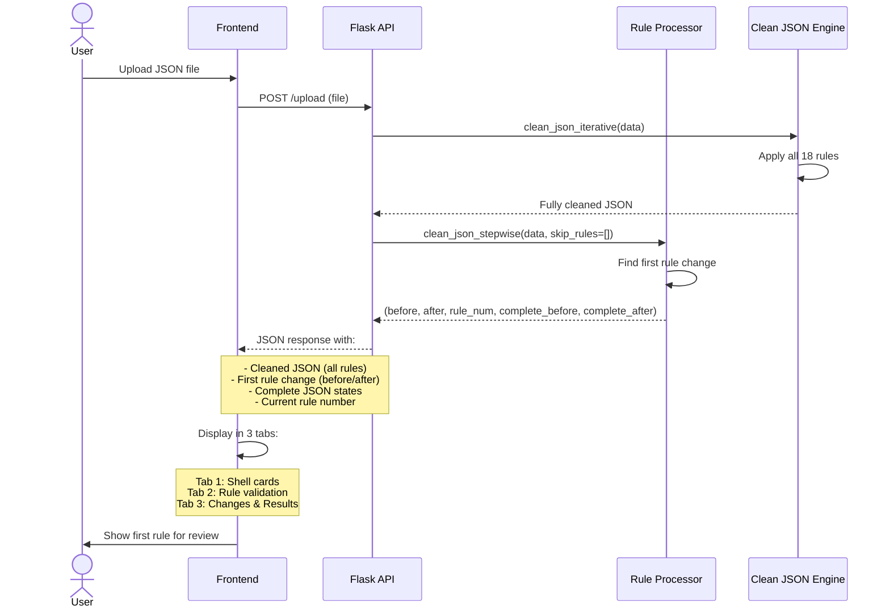
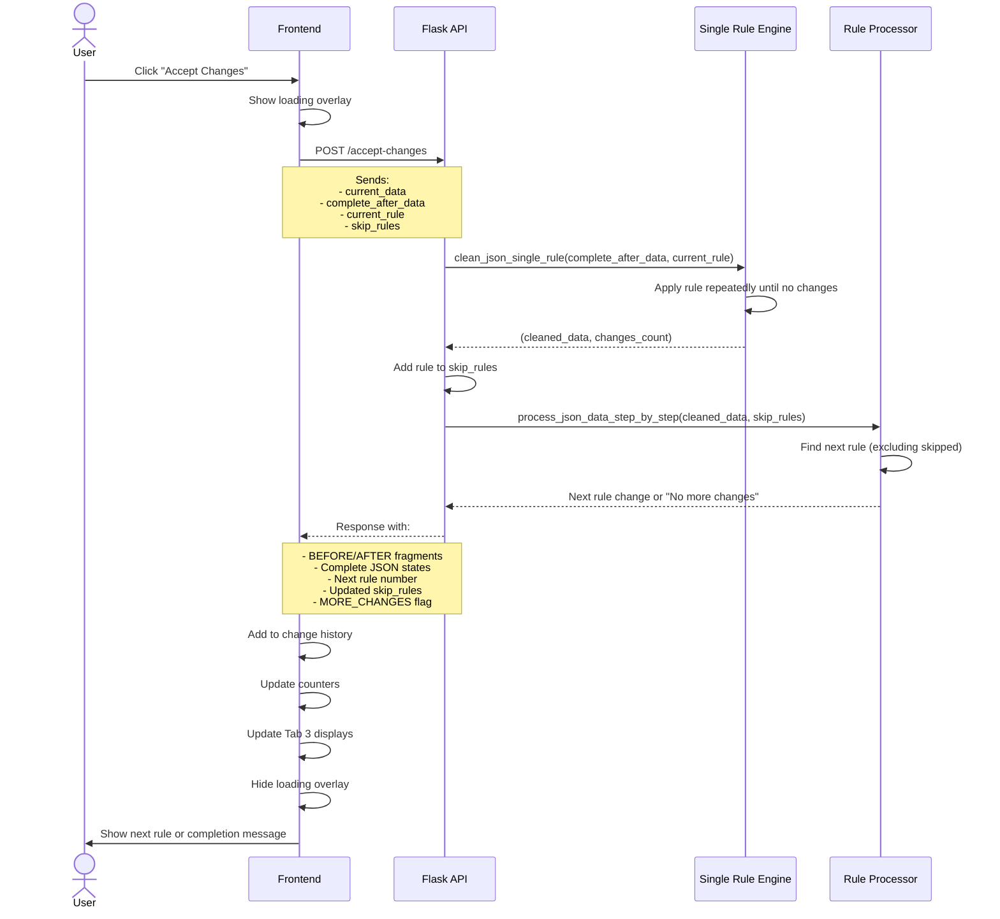
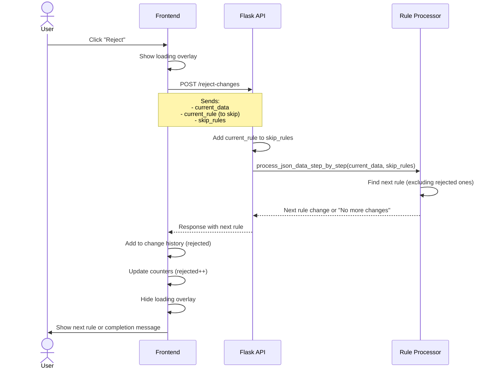
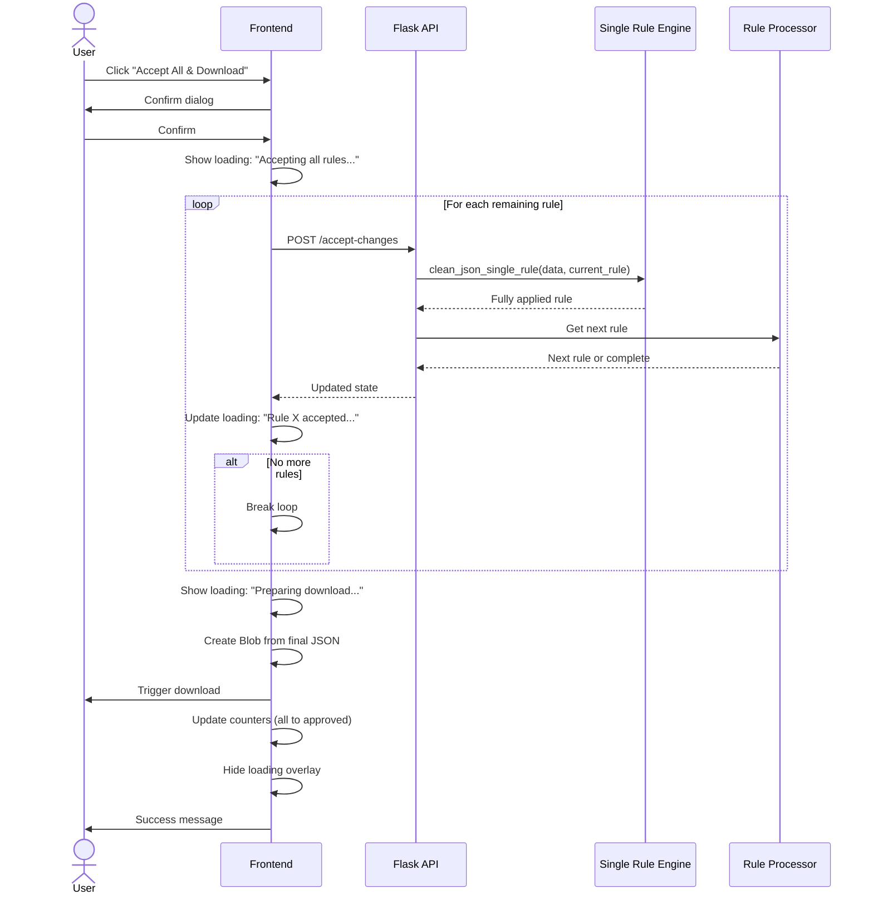
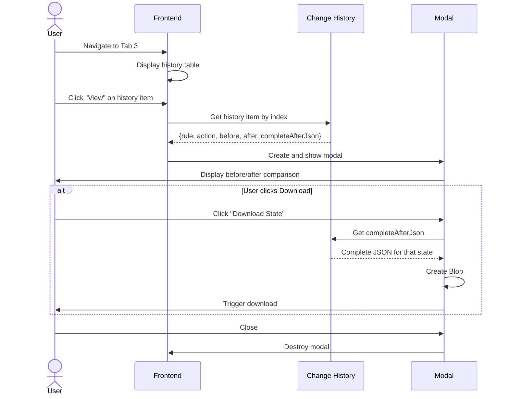
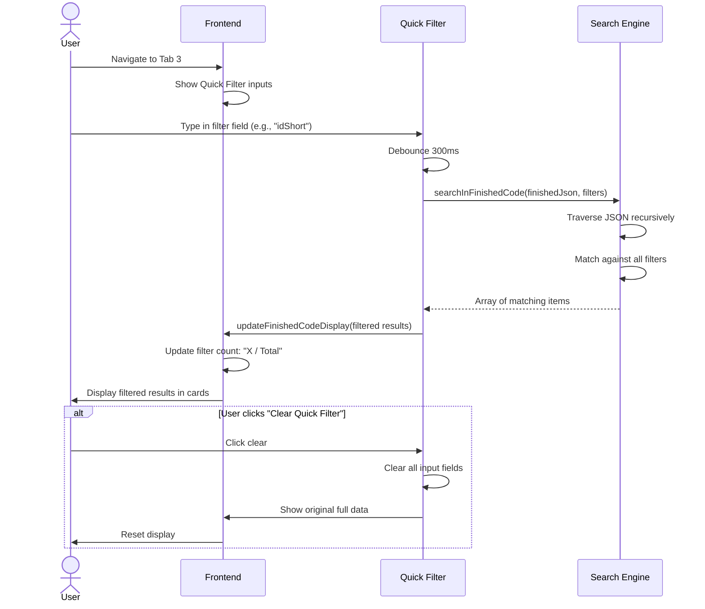
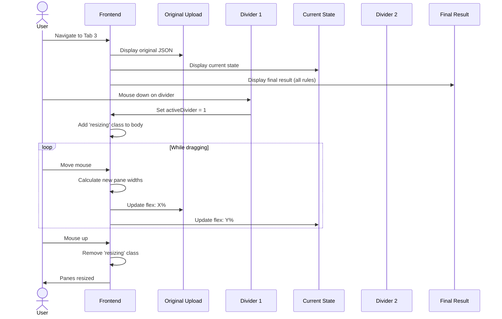
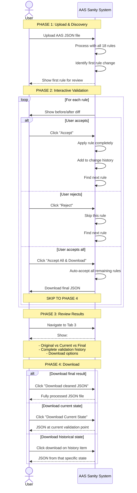
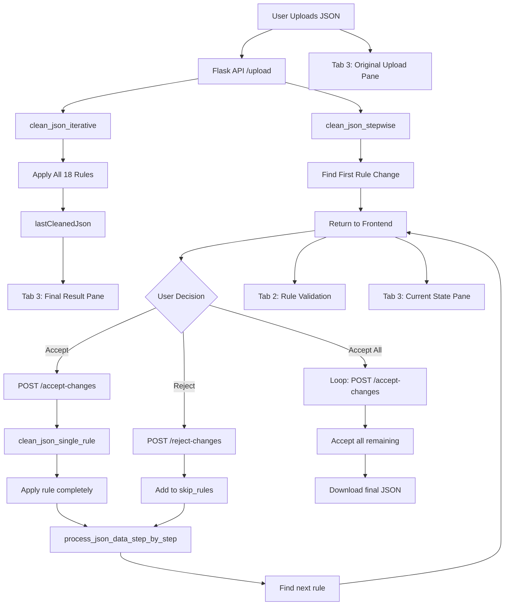

# AAS Sanity Checker - Sequence Diagrams

## 1. File Upload and Initial Processing

## 2. Accept Changes Flow

## 3. Reject Changes Flow

## 4. Accept All & Download Flow

## 5. View History & Download State

## 6. Quick Filter Flow (Tab 3)

## 7. Three-Pane Resizable View

## 8. Complete User Journey

## Data Flow Architecture

